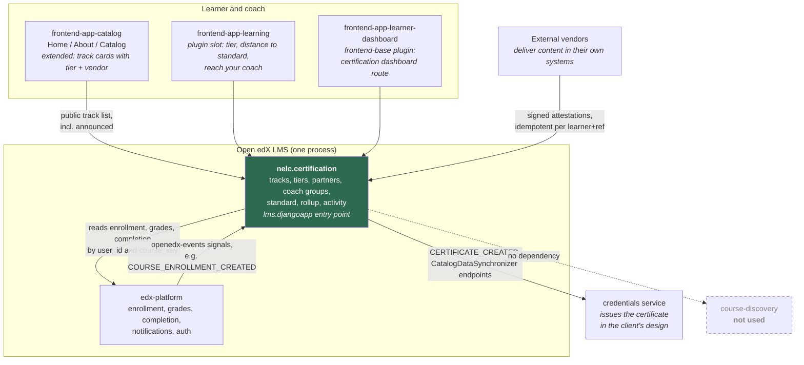
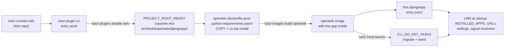
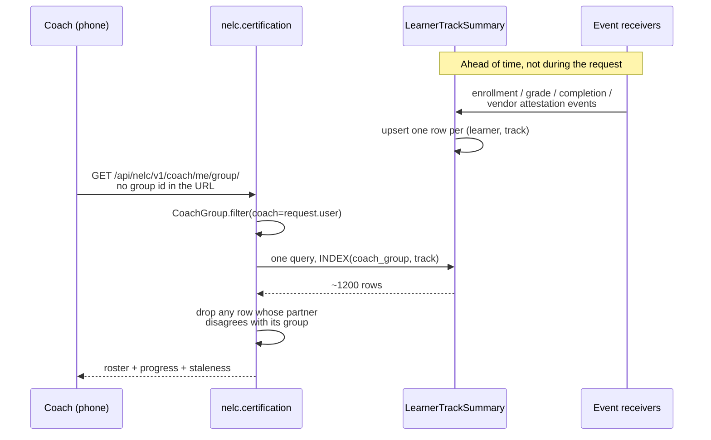
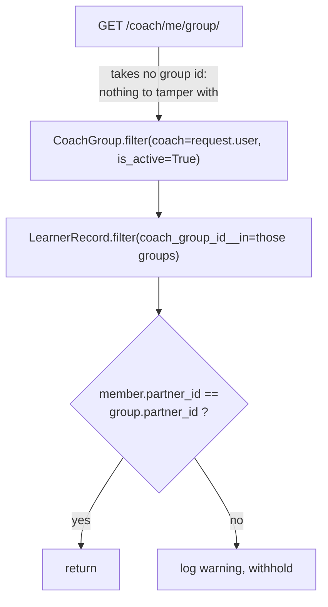

# Architecture diagrams

Three views: what runs where, how the plugin gets installed, and the request path that has to
come back in under two seconds.

## 1. Services and what we own

Solid boxes are ours. Dashed is deliberately not used.

The point of this picture is that our app and the platform are the same process. Every join the
coach view needs is a local query, not a service call. That is the whole reason discovery is not
in the solid part of the diagram.

## 2. How it installs

No `edx-platform` fork anywhere in this path.

Two details that matter. The Django app is copied rather than rendered as a Tutor template,
because Tutor's Jinja pass would try to interpret any `{{ }}` in Python source; it is therefore
deliberately not registered as an `ENV_TEMPLATE_TARGETS` entry. And the copy is
delete-then-write, because Tutor's template targets overwrite but never delete, so a file
removed from the plugin would otherwise stay in the environment and be baked into the next
image forever.

## 3. The coach view request path

The requirement is under two seconds for 200 learners across 6 tracks, on a phone, between
customer calls.

What is *not* on this path: no aggregation over `student_courseenrollment`, no grade
recomputation, no per-learner loop, and no call to another service. Those all happen earlier, on
events. The trade is that the numbers can be a few seconds old, and `updated_at` is returned so
the UI can say so instead of implying it is live.

### The isolation guarantee, as a diagram

An IDOR needs an object reference to tamper with, and this endpoint accepts none. The per-group
partner check is redundant with `LearnerRecord.clean()` on purpose, because `clean()` does not
run on bulk writes or a manual data fix, and the failure mode is leaking another company's staff
roster.
