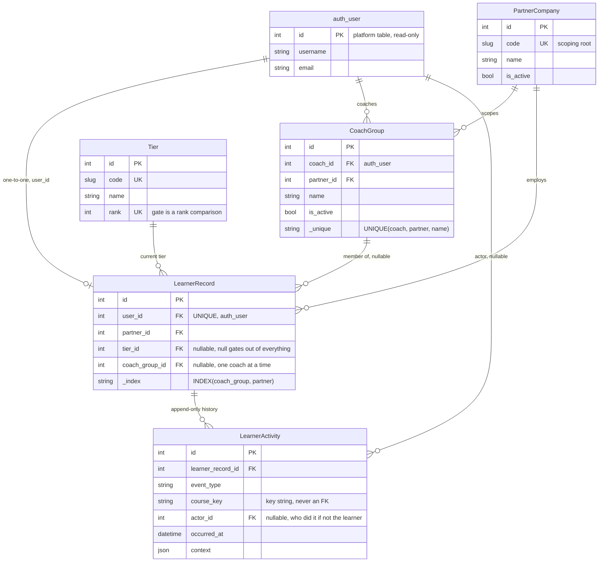
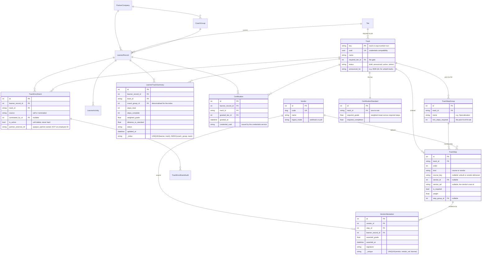

# Data model

Two diagrams. The first is what the slice actually migrates. The second is the full design,
including the tables the note argues for but the slice does not build.

**Bold** entities below are built and migrated. The rest are design only. Nothing in this app
holds a foreign key into a platform table; the boundary is drawn with `user_id` and course key
strings, following the Proposed Catalog Plugin's rule that a catalogue keeps "references to
courses, but will not store them directly to ensure data integrity and never be out of date,
like discovery".

## 1. The slice

Five tables. Enough to record a coach's group assignment and a learner's tier, and to react to
an enrollment.

Two things worth noting. `LearnerRecord.coach_group` and `LearnerRecord.partner` must agree,
enforced in `clean()` and re-checked per group in the endpoint, because the failure mode is
handing a coach another company's roster. And `LearnerActivity` has no `modified` column and no
delete permission in the admin: a coach's offline adjustment is a new row naming them as actor,
never an edit to an old one.

## 2. The full design

Adds the track spine, the certification standard, the vendor boundary and the read model that
answers the two-second requirement.

### Why `LearnerTrackSummary` exists

It is the only answer to "under two seconds for 200 learners across 6 tracks" that survives a
phone on a customer site. Computed live, that view is a fan-out across
`student_courseenrollment`, `grades_persistentcoursegrade`, the completion aggregator and
`VendorAttestation`, per learner per track. Precomputed, it is 1200 rows on one index. It is
maintained by the same receivers that write `LearnerActivity`, and `updated_at` lets the UI say
how stale it is rather than pretending it is live.

## Joins to the platform

All read-only, all on `user_id` or a course key string:

| Platform table | What we read | Joined on |
| --- | --- | --- |
| `auth_user` | identity, so we never copy names or emails | `LearnerRecord.user_id` |
| `student_courseenrollment` | whether the learner is in a course step | `user_id` + `course_id` |
| `grades_persistentcoursegrade` | the grade a step contributes to the standard | `user_id` + `course_id` |
| completion aggregator | progress within a step | `user_id` + `course_key` |
| `course_overviews` | display data for a step | `course_key` |

There is no reverse direction. Nothing in `edx-platform` knows this app exists, which is what
makes an upgrade to Willow a matter of our own migrations rather than a merge.
